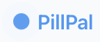

# PillPal: Medication Management Made Simple

## Introduction
PillPal is a comprehensive medication management application designed to help users track their medications, receive timely reminders, and maintain better medication adherence. With an intuitive interface and powerful features, PillPal makes it easy to never miss a dose again.

## Project Type
Fullstack

## Deployed App
Frontend: Vercel 
Backend: Firebase
Database: Firebase Realtime Database

## Directory Structure
```
PillPal/src/
├── App.css
├── App.jsx
├── assets/
│   ├── img.jpg
│   ├── logo.jpeg
│   ├── logo.png
│   └── react.svg
├── components/
│   ├── .DS_Store
│   ├── AIInsightsCard.jsx
│   ├── CallToAction.jsx
│   ├── Card.jsx
│   ├── FeatureCard.jsx
│   ├── FeatureSection.jsx
│   ├── Footer.jsx
│   ├── HeroSection.jsx
│   ├── Loader.jsx
│   ├── MedicationForm.jsx
│   ├── Navbar.jsx
│   ├── NotificationAlert.jsx
│   ├── NotificationsDropdown.jsx
│   ├── ProfileForm.jsx
│   ├── ProtectedRoute.jsx
│   ├── ShimmerLoader.jsx
│   ├── TopButton.css
│   ├── TopButton.jsx
│   ├── dashboard/
│   │   ├── DraggableMedicationList.jsx
│   │   ├── MainContent.jsx
│   │   ├── Navigations.jsx
│   │   ├── QuickStats.jsx
│   │   ├── Renewals.jsx
│   │   └── SideBar.jsx
│   └── ui/
│       ├── .DS_Store
│       ├── DatePicker.jsx
│       ├── alert-dialog.jsx
│       ├── avatar.jsx
│       ├── button.jsx
│       ├── calendar.jsx
│       ├── card.jsx
│       ├── dialog.jsx
│       ├── dropdown-menu.jsx
│       ├── form.jsx
│       ├── hover-card.jsx
│       ├── input.jsx
│       ├── label.jsx
│       ├── popover.jsx
│       ├── select.jsx
│       ├── separator.jsx
│       ├── sheet.jsx
│       ├── sidebar.jsx
│       ├── skeleton.jsx
│       ├── sonner.jsx
│       ├── tabs.jsx
│       ├── textarea.jsx
│       ├── toast.jsx
│       ├── toaster.jsx
│       ├── tooltip.jsx
│       └── use-toast.js
├── contexts/
│   ├── AuthContext.jsx
│   └── ThemeContext.jsx
├── hooks/
│   ├── use-mobile.js
│   ├── use-toast.js
│   ├── useMedicationNotifications.jsx
│   ├── useMedications.js
│   └── useUserProfile.js
├── index.css
├── lib/
│   ├── firebase.js
│   ├── gemini.js
│   └── utils.js
├── main.jsx
└── pages/
    ├── AIAssistant.jsx
    ├── Dashboard.jsx
    ├── ForgotPassword.jsx
    ├── Index.jsx
    ├── Login.jsx
    ├── Medications.jsx
    ├── NotFound.jsx
    ├── Profile.jsx
    ├── Reports.jsx
    └── Signup.jsx
       
```

## Video Walkthrough of the project
[Watch the project demonstration](https://www.youtube.com/watch?v=g_mDYyH2ofM&feature=youtu.be)

## Video Walkthrough of the codebase
[Watch the project demonstration](https://drive.google.com/drive/folders/1M0TBpq7FVTV45XnfUFhsYXusb67IXPvj?usp=sharing)

## Features

### Medication Tracking
- **Add & Manage Medications**: Easily add and track all your prescriptions in one place
- **Dosage Schedule**: Set up custom medication schedules with specific times and frequencies
- **Categorization**: Organize medications by category (Blood Pressure, Diabetes, etc.)

### Adherence Monitoring
- **Medication Status**: Mark medications as taken or missed
- **Adherence Statistics**: Track your medication adherence rate over time
- **Daily Progress**: See at-a-glance summaries of medications taken and missed

### Prescription Management
- **Renewal Reminders**: Get notified when prescriptions need to be renewed
- **Prescription History**: Keep track of your prescription history
- **Refill Tracking**: Monitor when you need refills

### Personalized Dashboard
- **Quick Stats**: View your medication adherence rate and active medications count
- **Today's Schedule**: See what medications need to be taken today
- **Upcoming Renewals**: Get alerts for prescriptions that need to be renewed soon

### User Profiles
- **Secure Authentication**: Secure login using Firebase Authentication
- **Profile Management**: Update personal information and preferences
- **Data Privacy**: Your health information stays private and secure

## Design Decisions & Assumptions
- Mobile-first design approach for better accessibility
- Firebase used for real-time updates and notifications
- User data is stored securely and privately
- Simplified medication input process to improve user experience

## Installation & Getting Started

### Prerequisites
- Node.js & npm installed - [install with npm]

### Installation

```bash
# Step 1: Clone the repository
git clone https://github.com/imRahul05/PillPal.git

# Step 2: Navigate to the project directory
cd PillPal

# Step 3: Install dependencies
npm i

# Step 4: Add the firebase API Keys in .env 
apiKey: FIREBASE_API_KEY,
authDomain: FIREBASE_AUTH_DOMAIN,
databaseURL: FIREBASE_DATABASE_URL,
projectId: FIREBASE_PROJECT_ID,
storageBucket: FIREBASE_STORAGE_BUCKET,
messagingSenderId: FIREBASE_MESSAGING_SENDER_ID,
appId: FIREBASE_APP_ID,
measurementId: FIREBASE_MEASUREMENT_ID

# Step 5: Start the development server
npm run dev
```

## Usage
1. **New User**:
   - Visit the landing page
   - Click "Get Started"
   - Create a new account on the signup page
   - Set up profile information
   - Add medications to start tracking

2. **Returning User**:
   - Log in with email and password
   - View dashboard with medication overview
   - Mark medications as taken
   - Manage medication list as needed
   - View adherence reports for insights

## Credentials
Demo User:
- Email: demo@example.com
- Password: demo@example.com

## APIs Used
- Firebase Authentication API
- Firebase Realtime Database API

## API Endpoints
- `/api/medications` - Manage user medications
- `/api/users` - User profile management
- `/api/reminders` - Medication reminder settings
- `/api/reports` - Generate adherence reports

## Technology Stack
- **Frontend Framework**: React with JavaScript
- **Routing**: React Router
- **Styling**: Tailwind CSS
- **UI Components**: shadcn/ui component library
- **State Management**: React Context API 
- **Database**: Firebase Realtime Database
- **Authentication**: Firebase Authentication

## Application Routes

| Route | Description | Access |
|-------|-------------|--------|
| `/` | Landing page with app introduction and features | Public |
| `/login` | User login screen | Public |
| `/signup` | New user registration | Public |
| `/forgot-password` | Password recovery | Public |
| `/dashboard` | Main user dashboard with medication overview and stats | Protected |
| `/medications` | Complete list of user medications with management options | Protected |
| `/profile` | User profile management | Protected |
| `/reports` | Detailed medication adherence and usage reports | Protected |
| `/not-found` | 404 error page | Public |

---

Developed with ❤️ by Rahul.

For support or questions, please contact rahulkumar20000516@gmail.com


